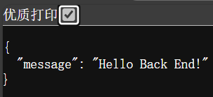

# 后端开发扫盲

本文主要面向与零基础入门的读者了解后端开发的基本概念以及相关技术内容。

## 后端开发在做什么

后端开发，也称为服务器端开发，涉及构建和管理在由开发者而非用户控制的计算机上运行的应用程序。后端开发侧重于管理数据和应用业务逻辑，而前端开发侧重于用户体验。

“前”和“后”是从用户的角度来看的。从用户的角度来看，他们的 Web 浏览器是前端。在 Web 应用程序背后执行的代码在后端。

由于后端开发人员控制着整个环境，因此他们可以灵活地使用他们喜欢的任何编程语言。相比之下，前端开发人员仅限于 Web 浏览器支持的语言，例如 JavaScript、编译为 JavaScript 的语言（例如 TypeScript）或编译为 WebAssembly 的语言。

与处理元素和用户界面的前端开发不同，后端开发侧重于通过管理用户请求、处理数据和优化应用程序性能来确保幕后操作。

后端开发涉及的内容要相对而言广很多。

- 提供 Api 接口：这是前后端交互的核心方式，也是前后端分离仍能完成同样的一份工作的关键。

- 实现业务逻辑：后端通过 Api 接口获取的数据显然不能直接返回给前端，后端需要根据这些信息以及前端调用的接口，来实现业务的逻辑，并返回前端需要的数据。

- 管理数据存储：为了提供用户更好的使用体验，一些必要的数据是需要存储的，如何更快更高效且正确的读写这些数据也是后端需要考虑的内容。


如果你已经读了[前端开发扫盲](./frontend.md)，那么你可以这样理解后端需要做的内容：完成一项任务中所有前端没有完成的内容。

## 在 Web 和软件开发中的重要性和作用

为应用程序创建基础至关重要，而这正是后端开发发挥作用的地方。它负责管理数据、逻辑和服务器，以确保一切顺利运行。

通过确保数据得到有效处理并与前端良好集成，后端开发在提供无缝用户体验和支持复杂的业务流程方面发挥着至关重要的作用。

## 后端系统的基本组成部分

后端系统由几个关键组件组成，这些组件协同工作以确保流畅的应用程序性能和数据管理：

- 服务器: 处理来自客户端的请求，执行必要的计算并将响应发送回客户端。服务器运行后端代码并管理应用程序逻辑。

- 数据库: 存储和管理应用程序使用的数据。数据库可以是关系型数据库（例如，MySQL、PostgreSQL）或 NoSQL 数据库（例如，MongoDB, Cassandra），具体取决于应用程序的需求。

- API（应用程序编程接口）: 促进应用程序的不同部分和其他应用程序之间的通信。API 允许前端和后端无缝交互，并实现与第三方服务的集成。

- 中间件: 充当中间层，处理各种任务，例如请求处理、身份验证、日志记录和错误处理。中间件有助于组织后端逻辑，并使应用程序更模块化和更易于维护。

- 框架和库: 提供简化后端开发的工具和预构建组件。流行的框架包括 `Spring(Java)`, `Gin(Golang)`， `Fiber(Golang)`, `Flask(Python)`。这些框架为构建和管理后端系统提供了结构化的方法。

## 示例

这是用 `gin` 实现的一个示例。

```go
package main

import "github.com/gin-gonic/gin"

func main() {
	server := gin.Default()

	server.GET("/", func(cxt *gin.Context) {
		cxt.JSON(200, gin.H{
			"message": "Hello Back End!",
		})
	})

	err := server.Run()
	if err != nil {
		panic(err)
	}
}
```

运行后，在服务器访问 `localhost:8080` 得到下图所示的结果。



当然，如果想要更加炫酷的界面的话就需要用前端的内容相互配合，才能实现了。

## 后端开发需要的工具

- 版本控制：`Git`

- 容器部署：`Docker`, `Kubernetes`

- Api 测试：Postman，Apifox。