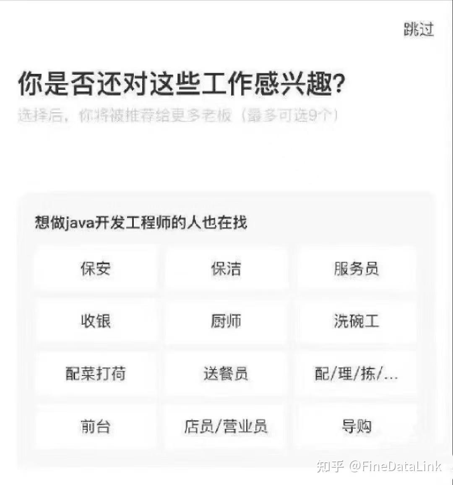

# 前端开发扫盲

本文的目的是帮助零基础的读者了解前端开发的基本概念和技术栈，扫除入门障碍，为进一步学习打下坚实基础。本文也会回答“前端是什么”“前端开发需要掌握哪些核心技术”等基本问题，也希望能破除一些同学对前端的误解(其实不一定是误解)。

## 对前端的错误认知

介绍前端之前，先来澄清一些对前端的常见误解：

1. **前端只是网页设计的**：有一些程序员开玩笑会戏称写前端的都是"切图仔"或者"美工"(确实有一点)，但实际上现代的前端开发基本已经基本不再负责视觉设计，该部分工作一般会交给UI设计师来完成。
2. **前端不需要编程**：这种误解虽然罕见(其实我自己没见有人讲过)，但是确实有人认为前端的工作并不涉及多少编程甚至不需要编程，实际上前端开发需要掌握多种编程语言和技术，如 HTML、CSS 和 JavaScript，这些都是前端基础,而且前端开发的工作中也会涉及到一些编程逻辑和算法,尤其是是在学习框架之后的组件间的交互和Hook的使用等会让人感到十分痛苦(这是真的)。
3. **前端开发很简单**：虽然入门相对容易，但前端开发的深度和广度都很大，要成为一名优秀的前端开发者，需要深入理解各种技术和工具，尤其是到中后期学习框架的时候，需要深入学习框架的规范和各种使用方法，学习难度相对比较大。
4. **前端和后端是完全独立的**：前端和后端是相互依赖的，前端需要与后端协作，确保数据的正确传输和处理，在一些工作中可能会涉及到后端的知识，也会有全栈开发的情况,在一些小型公司会让你把前后端的事都干完，甚至连网络安全的问题都会来找你(这是某人亲身经历)。

## 什么是前端？

要回答“前端是什么”,得先说说前端的概念,前端(Front-end)是网站前台部分，指运行在PC端、移动端等浏览器上并直接展现给用户浏览并提供给用户交互的网页界面。换句话说，你在网站或应用程序的屏幕上能看到的所有内容都属于前端。你访问的网站的图片、文字、可点击的按钮、导航栏等，以及你在手机上看到的应用界面，用手势放大缩小的图片，播放的视频等，都是前端的一部分。前端开发就是在构建所有的这些内容和功能，也即创造了你在屏幕上看到的外观和触摸到的体验。且前端开发的职能不仅仅是实现可视的交互界面，还需要将软件工程的原理和方法使用到开发中，也即前端工程化。

## 前端开发的职责

前端开发的主要职责包括以下几个方面：

1. **用户界面的实现**：前端开发者负责将设计师提供的视觉设计稿转化为实际可用的网页界面。
2. **响应式设计**：确保网页在不同设备和屏幕尺寸上都能良好显示和操作，提供一致的用户体验。
3. **交互功能开发**：通过编写代码实现网页的交互功能，如按钮点击、表单提交、动态内容更新等，使用户能够与网页进行互动。
4. **性能优化**：前端开发者需要优化网页的加载速度和运行效率，提升用户体验。
5. **跨浏览器兼容性**：确保网页在不同浏览器上都能正常工作，解决浏览器差异带来的问题。
6. **前端工程化**：前端开发者需要使用自动化的构建工具(如webpack、Vite等)来处理和打包前端资源、版本控制工具(如Git)来管理代码和项目、包管理工具(如npm、yarn等)来提高开发效率，也需要使用模块化的开发模式，将代码拆分为更小的、易于管理的模块，有助于之后的复用、维护与扩展，还需要基于组件的思想构建用户界面,这些都是前端工程化的内容。
7. **与后端协作**：前端开发者需要与后端开发者紧密合作，确保前后端数据的正确传输和处理。


## 前端开发的过程

前端开发通常包括如下过程：

1. **产品和业务对接,需求敲定**：每个项目的开始，都会有一个明确的需求梳理过程。首先是产品和业务团队的对接，产品经理会根据市场需求、用户反馈或者公司战略，提出相应的功能需求。这个阶段，前端团队通常需要和产品、设计、以及后端团队保持紧密沟通，确保功能需求和用户体验的一致性。

2. **需求评审，多方确认细节**：产品需求整理后，会进行需求评审。这是一个非常重要的环节，前端、后端、测试等各方会一起参与。大家共同讨论需求的可行性、实现的技术方案、风险评估等，确保每个功能点都能得到合理的实现，同时避免后期出现大量返工。

3. **技术方案协商，前后端分工**：需求评审后，前端团队会协商出相应的技术方案。前端需要根据需求来进行技术选型,确定要使用哪些框架和工具。

4. **排期和开发计划，确保时间有序**：接下来，产品经理会根据项目的复杂程度和优先级，给出ddl，并明确开发阶段是否需要分批上线。在大厂中，开发进度通常需要精细化管理，确保每个环节按时完成。前端在排期中，通常会根据功能模块的大小、复杂度，以及人员的分配情况来评估开发时间。

5. **接口文档与开发，前端开始编码**：前后端方案确定后，后端会提供接口文档，前端根据文档来进行开发。接口文档包含了每个接口的请求方式、参数说明、返回数据等信息。前端通过与后端提供的数据接口进行对接，开发出相应的页面或功能模块。在开发过程中，前端通常会使用版本控制工具（如Git）进行代码管理。

6. **测试用例评审与自测，确保质量**：开发过程中，QA团队会准备相应的测试用例，确保每个功能点都经过充分的验证。前端开发完成后，通常会根据QA提供的冒烟用例进行自测，检查是否有明显的bug和问题。自测之后，前端会提交代码并进行提测。

7. **提测与修复Bug，保证稳定性**：提交后，QA团队会进行更加全面的功能和性能测试，确保项目上线后没有明显问题。这个阶段，前端需要积极配合QA，查看反馈的bug并及时修复。通常情况下，开发和测试团队会在这一阶段共同处理大量的bug修复。

8. **上线，功能发布**：当开发和测试都完成后，项目终于迎来了上线阶段。发布后会做最后的回归测试，确保没有遗漏任何关键问题。最终，项目顺利上线，并进行一些监控和跟踪，确保系统稳定运行。

参考自[大厂前端开发流程解析：从需求到上线全流程](https://www.nowcoder.com/feed/main/detail/51d2fdeef7f94514b73f794fe22fc126)

## 前端开发的核心技术

相比较与后端，前段的技术更迭要更为迅速，可能每一天都有新的前端框架和工具出现。尽管如此，前端开发的核心技术还是比较稳定的，主要包括以下三大核心技术，也被称为 `前端三剑客` :

")

 ### HTML（超文本标记语言）

 `HTML（HyperText Markup Language）` 是构建网页的基础，用于定义网页的结构和内容。它使用标签来标识不同类型的内容，如标题、段落、链接、图像等。通俗点说，`HTML`负责网页的架构，是前端的"骨架"。

**HTML 的基本结构**

```html

<!DOCTYPE html>
<html lang="en">
<head>
    <meta charset="UTF-8">
    <meta name="viewport" content="width=device-width, initial-scale=1.0">
    <title>Document</title>
</head>
<body>
    <h1>Hello, World!</h1>
    <p>This is a simple HTML document.</p>
</body>
</html>

```

在上面的例子中中各个标签是什么请参见[前端总览](../Front-end/Front-end.md)一文的介绍。


### CSS（层叠样式表）

`CSS（Cascading Style Sheets）` 用于控制网页的外观和布局。通过 `CSS`，开发者可以设置颜色、字体、间距、对齐方式等，使网页更具吸引力和可读性，也可以控制网页的布局，使得网页在不同的屏幕尺寸和设备上都能保持良好的视觉体验，也即响应式设计。简单的说，`CSS` 负责网页的样式、美化，是前端的"皮肤、衣服"。

**CSS 的基本用法**

```html

<!DOCTYPE html>
<html lang="en">
<head>
    <meta charset="UTF-8">
    <meta name="viewport" content="width=device-width, initial-scale=1.0">
    <title>Document</title>
    <style>
        body {
            background-color: #f0f0f0;
            font-family: Arial, sans-serif;
        }
        h1 {
            color: #333;
        }
        p {
            color: #666;
        }
    </style>
</head>
<body>
    <h1>Hello, World!</h1>
    <p>This is a simple HTML document with CSS styling.</p>
</body>
</html>

```

在上面的例子中中各个标签是什么和基础的JS知识请参见[前端总览](../Front-end/Front-end.md)一文的介绍。

### JavaScript

`JavaScript` 是一种编程语言，用于为网页添加交互功能。通过 `JavaScript`，开发者可以实现动态内容更新、表单验证、动画效果等，使用户体验更加丰富，让网页不仅仅是静态的内容，而是可以响应用户的操作。总的来说，`JavaScript` 负责网页的交互，是前端的"动作"。

 **JavaScript 的基本用法**

```html

<!DOCTYPE html>
<html lang="en">
<head>
    <meta charset="UTF-8">
    <meta name="viewport" content="width=device-width, initial-scale=1.0">
    <title>Document</title>
     <style>
        body {
            background-color: #f0f0f0;
            font-family: Arial, sans-serif;
        }
        h1 {
            color: #333;
        }
    </style>
</head>
<body>

    <h1>Hello, World!</h1>
    <button onclick="showMessage()">Click Me</button>

<script>
    function showMessage() {
        alert("Hello, World!");
    }
</script>
</body>
</html>

```

在上面的例子中中各个标签是什么还是请参见[前端总览](../Front-end/Front-end.md)一文的介绍。

下图展示了前端三大核心技术各自的职责与关系：

")

## 前端开发的常用工具和框架

常用工具和框架可以参见[前端总览](../Front-end/Front-end.md)一文的介绍。在顶部那个超大的图里都有提到。

## 学习资源推荐

这些是我个人的一些推荐，只作为参考，大家也可以根据自己的情况选择其他资源学习:

- [MDN Web Docs](https://developer.mozilla.org/zh-CN/)：全面的前端技术文档和教程。
- [黑马程序员前端入门视频](https://www.bilibili.com/video/BV14J4114768/?spm_id_from=333.337.search-card.all.click&vd_source=ea81311cb799cad65b2236313c8dec16)：适合初学者的中文前端视频教程。
- [黑马程序员前端JavaScript入门到精通](https://www.bilibili.com/video/BV1Y84y1L7Nn?spm_id_from=333.788.recommend_more_video.0&trackid=web_related_0.router-related-2206146-5nk2d.1761266247018.856&vd_source=ea81311cb799cad65b2236313c8dec16)：系统学习JavaScript的中文视频教程。

## 学习路线

前端的学习路线可以看[TIC-DLUT 前端开发学习路线图](../README.md)。其实学习方式有多种多样，可以根据自己个人的情况来学习，不一定非得照着学习路线来学，但学习路线会给你们一个比较系统的学习思路，如果对怎么学习前端一无所知的同学还是建议照着学习路线来学。

## 程序员笑话

因为领导说我写的文档不像是人写的，所以我决定夹带一些程序员笑话来自证清白,大家看一乐就行了(看看就行了不要当真):




## 结语

相较于后端，前端开发的上手难度要更为简单，学习了基本的 `HTML`、`CSS` 和 `JavaScript` 知识，就可以开始构建简单的网页，这也是为什么很多人说前端容易被取代的原因。但是如果想要成为一名优秀的前端开发者，还需要学习多种工具和框架的使用，并不断实践和积累经验。前端的知识体系庞大且更新迅速，保持学习的热情和持续的练习是不被淘汰的关键。希望本文能帮助你扫清前端开发的入门障碍，开启你的前端学习之旅！