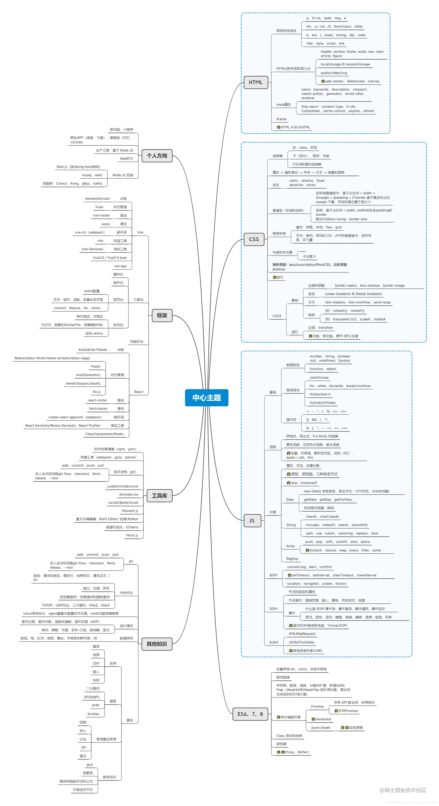

## 前端基础

### HTML

- **Head 和 Meta** title charset link script style keyword description author 等
- **基础标签** div h1 h2 h3 p img ul ol li table 等
- **表单** form input button select 等
- **媒体** video audio 等
- **2D 3D** SVG Canvas 等

### CSS

- **选择器** 标签 class id 属性等
- **图文样式** 字号 行高 颜色等
- **布局**
    - inline block inline-block
    - 盒子模型
    - margin 相关：纵向合并，负 margin
    - flex 布局
    - grid 布局
    - float 布局
    - BFC
- **定位**
    - relative
    - absolute
    - fixed
    - 定位上下文
- **响应式** viewport rem vw vh
- **渐变和动画** transition animation
- **模块化**
    - css module
    - css-in-js
    - BEM
- **第三方库**
    - NormalizeCSS ResetCSS
    - PostCSS
    - AnimateCSS HoverCSS
    - TailwindCSS BootStrap
    - Sass Less Stylus
    - caniuse.com 检测浏览器兼容性

### JS 和 ES

- **变量和类型**
    - let const
    - undefined string number boolean object functioin symbol bigint
- **字符串**
- **数组**
- **对象**
- **函数**
- **class** 原型，原型链，继承
- **作用域** 作用链，自由变量，闭包
- **异步** Promise Async/await 微任务/宏任务 EventLoop
- **Map 和 Set**
- **Proxy 和 Reflect**
- **Generator** `*` yield
- **正则表达式**
- **日期和时间**
- **模块化** AMD CMD UMD CommonJS ES-Module
- **异常处理**
- **第三方库** lodash jQuery Axios day.js ECharts D3 Anime.js jsPDF UUID i18next ...

### JSX

- **语法糖** 本质是 JS 函数
- **插值和表达式** 写法 `{xxx}`
- **事件** 写法 `onClick={fn}`
- **自定义组件** 首字母大写
- **注视** `{/* This is a comment */}`

### TS

- **新增加的类型** any void never
- **类型定义和检查** 变量，函数参数，函数返回值，class 等
- **数组和元祖**
- **Enum 枚举**
- **自定义类型 type** 交叉类型 联合类型
- **接口 interface** 接口的扩展和继承
- **抽象类 Abstract class**
- **泛型 Generics**
- **装饰器 Decorator**
- **类型定义文件 `.d.ts`** 安装第三方的如 `npm install @types/lodash`
- `tsconfig.json` 配置

### JS Web API

- **DOM API** 查询 创建 修改 移动 DOM 节点，DOM 树，DocumentFragment
- **DOM 事件** 事件绑定，事件冒泡，Event 参数，事件代理
- **BOM API** window navigator screen location history 等
- **存储** cookie localStorage sessionStorage indexedDB
- **Ajax** XMLHTTPRequest fetch
- **通讯** postMessage，BroadcastChannel
- **WebWorker** 线程，sharedWorker，ServericeWorker，通讯
- **jsbridge** 如微信 jssdk

## 网络 HTTP 协议

- **URL** 组成
- **Header** Content-type, Accept, Authorization, User-Agent, Host, Referer, Cookie, Cache-control, Content-length, Connection ...
- **Method** GET, POST, PUT, DELETE, PATCH, RestfulAPI
- **Request** url params body
- **Response** status body set-cookie ...
- **Status code** 10x 20x 30x 40x 50x
- **cookie** 服务端 set-cookie，浏览器禁用第三方 cookie
- **Session** 服务端存储数据
- **JWT** 客户端存储数据，替换 token，OAuth 第三方登录，SSO 单点登录 ...
- **跨域** 浏览器同源策略，JSONP，CORS，跨域传递 cookie
- **浏览器缓存策略**
    - 强制缓存 Cache-Control
    - 协商缓存 Etag，If-None-Match，Last-Modified， If-Modified-Since
    - 缓存位置 Memory Cache, Dist Cache, Service worker Cache
- **HTTPS** SSL 协议，SSL 证书，加密过程（非对称和对称加密），通讯过程，options 请求
- **WebSocket**
- **GraphQL**
- **大文件上传** 切片上传，断点续传，秒传

