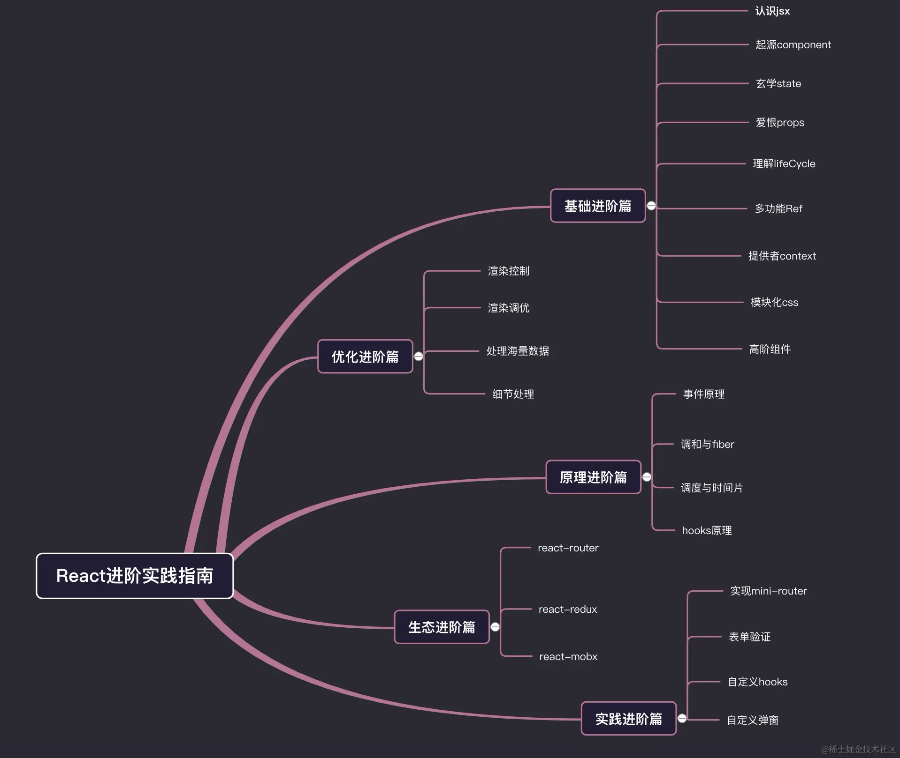

> 写在开头:
任何一个前端框架的学习都要经过长期的项目练习和源代码的深入理解，这里主要是做最基础的介绍
进阶的内容这里就先放一个思维导图有兴趣的同学可以先行联系作者（simonzywu），具体的内容后续会补充进来……(确实太忙了没时间😭)

### React 使用

- **JSX 语法** 上文有介绍
- **函数组件 Functional Component**，纯函数，副作用，生命周期，组件通讯
- **属性 Props**
- **状态 State** 不可变数据，immer.js，“合并”更新，异步更新，表单受控组件
- **Hooks** useState, useEffect, useRef, useContext ... 自定义 Hook, react-use
- **Context** Provider, Consumer
- **性能优化** useMemo, useCallback, React.memo, React compiler ....
- **Suspense 和异步组件**
- **报错 ErrorBoundary**
- **服务端组件 RSC** 服务端渲染 SSR

### React 原理

- **Virtual DOM** React 使用的虚拟文档对象模型，通过对比更新来优化性能
- **Diff 算法** 对比新旧 vdom 并更新真实 DOM
- **Reconciliation** React 的更新算法，用于高效地比较虚拟 DOM 与旧虚拟 DOM 之间的差异，并决定最小化的更新操作
- **React Fiber** React 16 引入的重写的渲染引擎，提供更高效的渲染机制
- **React 合成事件** React 使用事件代理机制，将事件监听器挂载到根 DOM 节点上，而不是每个组件的 DOM 节点，减少了事件监听器的数量，提高了性能
- **React Concurrency** 是 React 18 引入的一项重要特性，使用时间分片和任务调度，用于提升应用的响应性和性能
- **React Batching Update** React 会对多次 state 更新进行批量处理，合并成一次更新，以减少不必要的重渲染和性能开销

### React 生态

- **框架** umijs, Next.js, Remix(react-router), Gatsby, React-Native
- **UI 组件库** AntD, MUI, ShadcnUI
- **状态管理** Redux, Zustand, MobX, Recoil
- **CSS 样式解决方案** TailwindCSS, Styled-components
- **表单和校验** Formik, React hook form
- **数据获取** React Query, SWR, Apollo Client
- **i18n** react-i18next
- **测试** Jest, Reat testing library, Storybook

